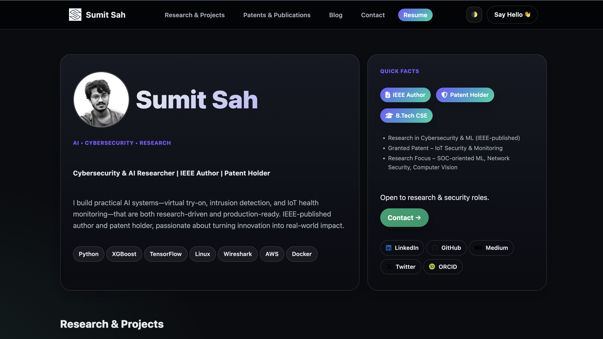

# Sumit Prasad Sah — Portfolio

[](https://sumit-jr.github.io/Portfolio/)
[](#license)

A fast, accessible, mobile-first portfolio focused on **AI & Cybersecurity research**.  
Highlights: intrusion detection with XGBoost, virtual try-on, and an IoT vitals system (**patent granted**), plus publications with **DOIs**.

**Live:** https://sumit-jr.github.io/Portfolio/

---

## Features
- **Responsive UI**: sticky header, mobile hamburger, equal-height cards
- **Dark mode by default** with a **theme toggle** (persisted via `localStorage`)
- **Research-friendly**: DOIs, ORCID, code links per project
- **Contact form** via FormSubmit (no backend)
- **A11y**: skip link, focus states, reduced-motion support
- **SEO/social**: canonical URL, Open Graph/Twitter cards, `schema.org/Person`

---

## Screenshots



| Projects | Works |
|---|---|
|  |  |

---

## Tech Stack
- **HTML5** (semantic layout, meta/OG/Twitter, JSON-LD)
- **CSS3** (custom properties, grid/flex, modern media queries)
- **Vanilla JS** (theme toggle, menu, IntersectionObserver animations)

---

## Structure
```text
Portfolio/
├─ index.html
├─ thankyou.html
├─ css/
│  └─ styles.css
├─ js/
│  └─ app.js
└─ assets/
   ├─ logo.png
   ├─ profile.jpg
   ├─ og-cover.jpg
   ├─ Projects/
   ├─ Patents/
   └─ Publications/
```
# Getting Started

## Prerequisites
- Any static server (or just open `index.html` directly).

## Run locally

**Option A:** Open `index.html` in your browser.  

**Option B:** Serve the folder:
bash # from repo root python3 -m http.server 8080 # visit http://localhost:8080
